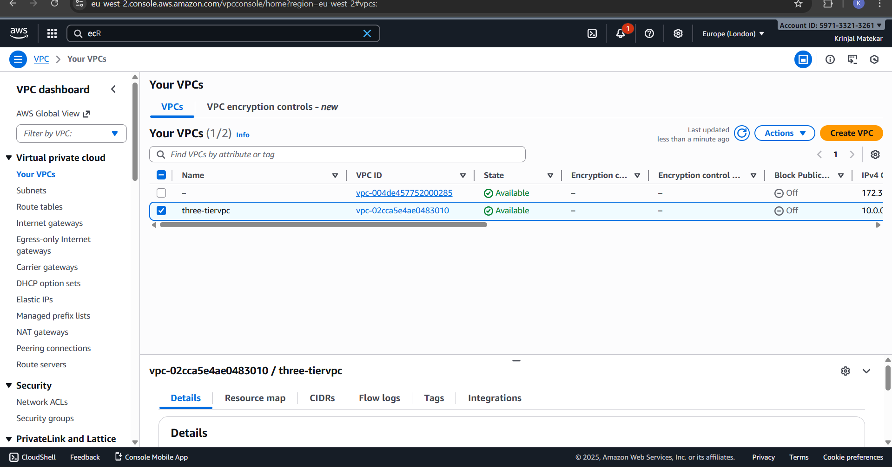
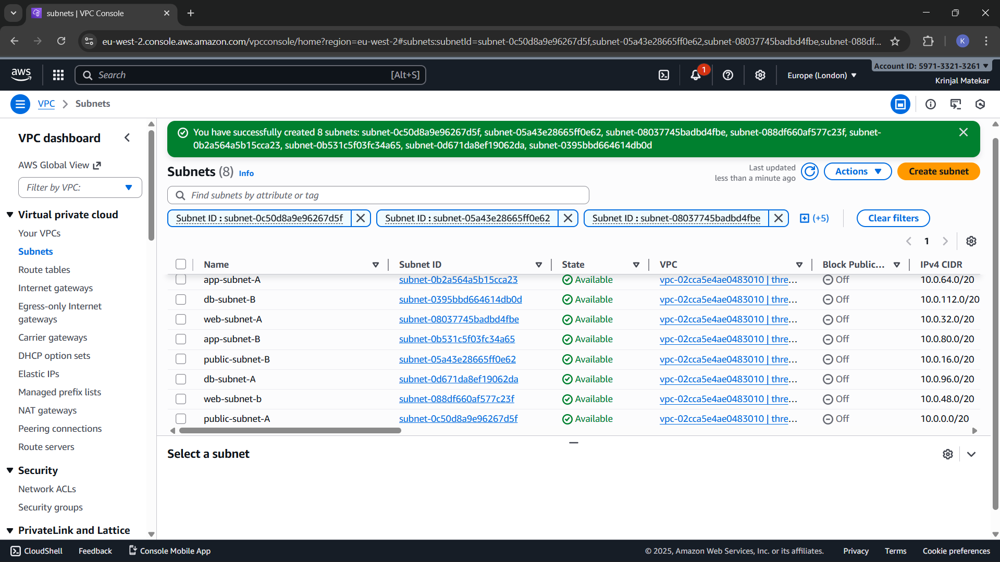
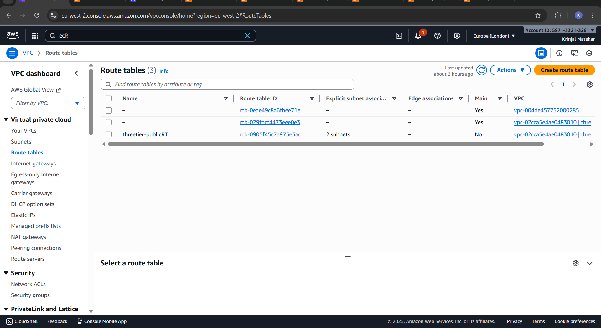
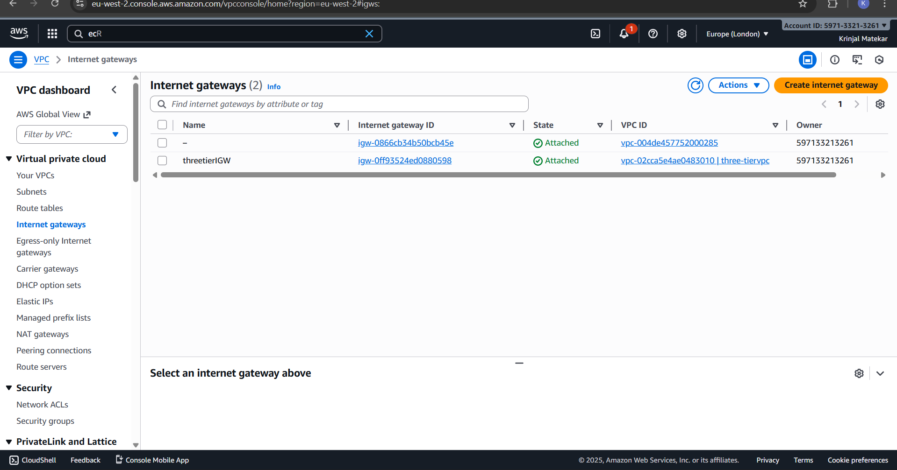
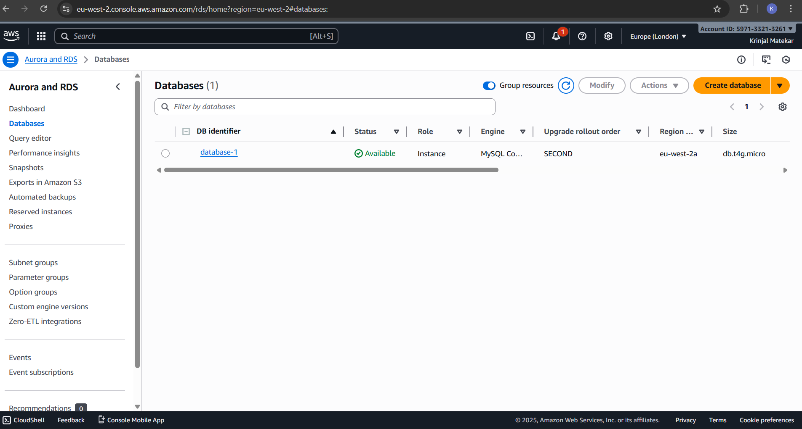
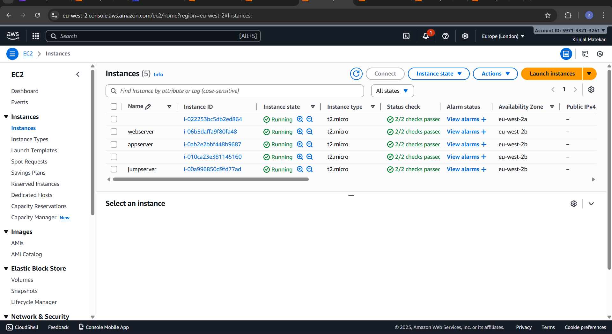
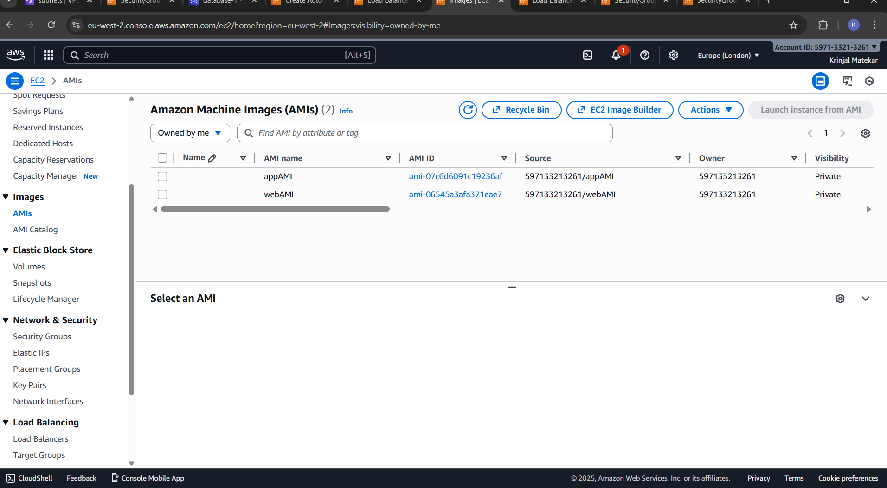
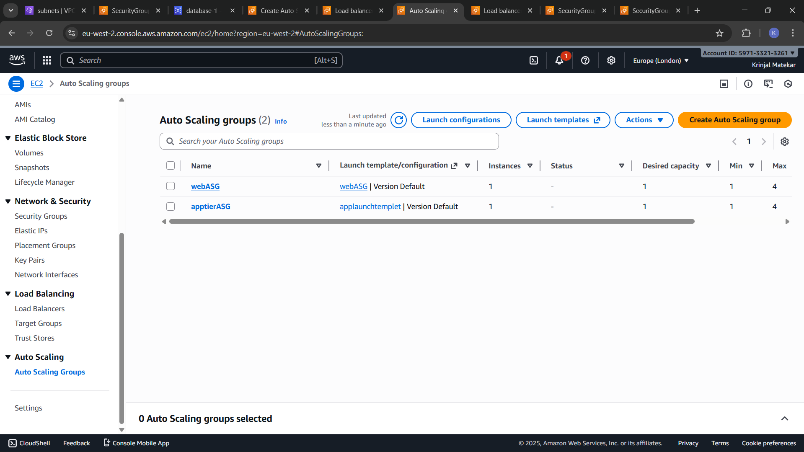
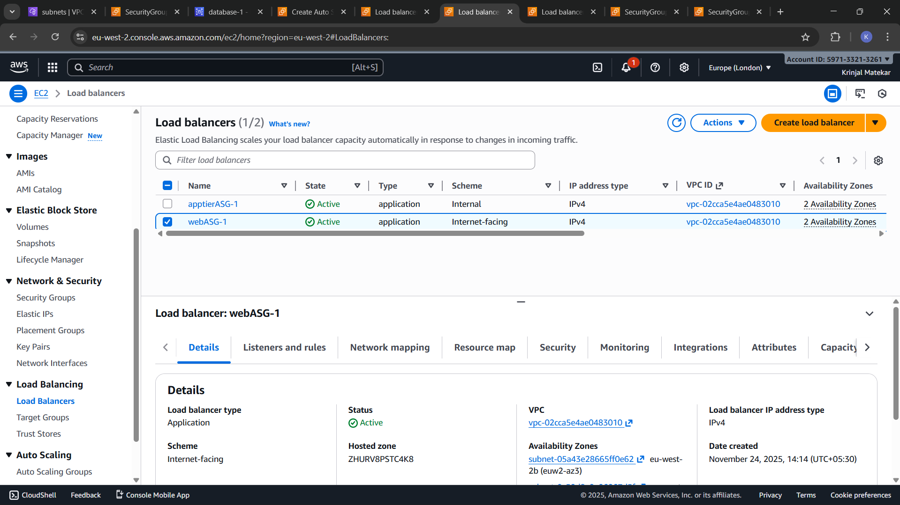

# Three-tier-Architecutre with loadbalancer and Autoscaling

  This project follows a Three-Tier Architecture deployed inside AWS, where the application is divided into three separate layers to improve security, performance, and scalability.

## Architecutre :


## What is Three-Tier Architecture  
 Three-Tier Architecture is a software design model that divides an application into three separate layers. Each layer has its own responsibilities, which makes the system more secure, scalable, and easy to manage.

## Create Architecture
## Step 1: Create VPC 


1. Click on Your VPC > Create VPC.

2. Provide a name for the VPC , and also the IPv4 CIDR (10.0.0.0/16) . Then click on create VPC.
---
## Step 2: Create Subnet
Create 8 Subnets- 2 Public Subnet, 2 Private subnets for Webtier, 2 subnets for Apptier and 2 subnets for dbtier.

1. PublicSubnetZoneA- 10.0.0.0/20
2. PublicSubnetZoneB- 10.0.16.0/20
3. WebSubnetZoneA- 10.0.32.0/20
4. WebSubnetZoneB- 10.0.48.0/20
5. AppSubnetZoneA- 10.0.64.0/20
6. AppSubnetZoneB- 10.0.80.0/20
7. DBSubnetZoneA- 10.0.96.0/20
8. DBSubnetZoneB- 10.0.112.0/20


---
## Step 3: Create Route Table

 

## Step 4: Create IGW

1. Then Create Internet Gateway and Attach to the VPC.

2. Add route of Internet Gateway in Public Route Table

## Step 5: Create RDS Database




Create Database and port number 3306 in Security Groupof RDS

### Steps to Create MySQL RDS:
1. Open RDS Console

* Go to AWS Console → Search for RDS → Click Create Database.

2. Choose Database Creation Method
* Select Standard Create.

3. Select Engine
* Choose MySQL as the database engine.
* Select the MySQL version you need (latest recommended).

4. Templates Choose a template.
* Free Tier (for testing)

5. Settings
* DB Instance Identifier: e.g., my-mysql-db
* Master Username: e.g., admin
* Password: Enter and confirm a strong password.

6. Instance & Storage

* Choose an Instance class (e.g., db.t3.micro for free tier).
* Allocate storage (default 20GB).

7. Connectivity

* Choose your VPC.
* Decide if the DB should be publicly accessible.
* Attach a Security Group:
* Allow inbound traffic on port 3306 (MySQL) from trusted IPs or EC2.

8. Create Database
* Click Create Database.
* Wait until status changes to avaliable

### Step 6: Launch Ec2 Instances


1. Lauch JumpServer in public Subnet for ssh to RDS

* Install Mariadb 
* Create Database and Table
```
sudo yum install mariadb105-server -y

sudo mysql -u root -p -h (RDS endpoint)
```
2. Lauch Appserver in Public Subnet

* Install Nginx, php and php-mysql connector
* Start and enable nginx and php-fpm
```
sudo yum install php nginx -y
sudo service nginx start
sudo service php-fpm start
sudo yum install mysql-php8.4.x86_64
sudo service nginx restart
sudo service php-fpm restart
```
3. Launch WebServer in Public Subnet
* Install nginx and enable
```
 sudo yum install nginx
 sudo service start nginx
 sudo systemctl enable nginx
 ```

 Add Loaction Block in Nginx.conf File
 ````
 loaction ~ \.php$ {
 proxy_pass http://(loadbalancer DNA)
 }
`````
---

### Step 6 : Get AMI

Create AMI(Amazon Machine Image) of Webserver and Appserver for AutoSCaling

---

### Step 7: Create AutoScaling

*  Create auto sacling for webtier and apptier.

1. Launch Template for Webtier and Apptier

2.  Create Auto Scaling Group
* Mimimum- 1
* Maximum - 4
* Desire - 1


--
## Step 8: Create LoadBalancer 
1. Create Internet Facing Load Balncer for WebTier.

2. Create Internal Load Balancer for AppTier


---


## RESULT:
 


---
### Conclusion :
This project demonstrates the deployment of an application using a Three-Tier Architecture on AWS, ensuring high availability, security, and scalability. By using a Load Balancer, traffic is efficiently distributed across multiple servers, while the Auto Scaling Group automatically adjusts the number of instances based on demand. Separating the application into Web Tier, Application Tier, and Database Tier improves performance and provides strong network isolation.
Overall, this architecture delivers a reliable, secure, and cost-effective cloud environment suitable for production workloads.

___

## Writer: Krinjal M.


